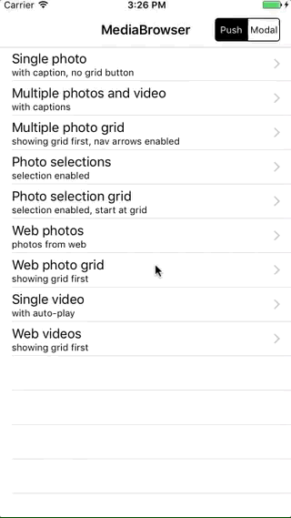
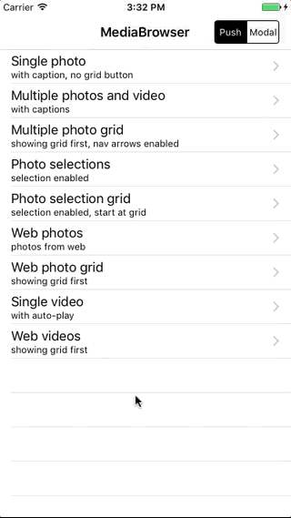

<p align="center">
  
  <a href="https://cocoapods.org/pods/MediaBrowser" target="_blank">
    
  </a>
  <a href="https://github.com/younatics/MediaBrowser" target="_blank">
    
  </a>
  <a href="http://cocoadocs.org/docsets/MediaBrowser" target="_blank">
    
  </a>
  <a href="https://github.com/Carthage/Carthage" target="_blank">
    
  </a>
    <a href="(https://github.com/younatics/MediaBrowser/blob/master/LICENSE" target="_blank">
    
  </a>
</p>

## Intoduction
🏞 MediaBrowser is written in Swift3, using [SDWebImage](https://github.com/rs/SDWebImage) 4.2.0 version for caching. 

| Single Photo | Multiple Photos And Video |
| ------------- | ------------------------- |
|  |  |
| Multiple Photo Grid | Multiple Photo Selection |
|   |   |
| Web Photos | Web Photos Grid |
|   |   |

## Requirements
`MediaBrowser` is written in Swift 3. Compatible with iOS 8.1+

## Installation
### Cocoapods
```ruby
pod 'MediaBrowser'
```
### Carthage
```
github "younatics/MediaBrowser"
```

## Usage
### Basic Usage

Get `MediaBrowser` and set `MediaBrowserDelegate`
```Swift 
let browser = MediaBrowser(delegate: self)
self.navigationController?.pushViewController(browser, animated: true)

//MediaBrowserDelegate
func numberOfMedia(in mediaBrowser: MediaBrowser) -> Int {
  return mediaArray.count
}
    
func media(for mediaBrowser: MediaBrowser, at index: Int) -> Media {
  if index < mediaArray.count {
    return mediaArray[index]
  }
  return DemoData.localMediaPhoto(imageName: "MotionBookIcon", caption: "Photo at index is Wrong")
}
```

## References
#### Please tell me or make pull request if you use this library in your application :) 

## Author
[younatics 🇰🇷](http://younatics.github.io)

## License
MediaBrowser is available under the MIT license. See the LICENSE file for more info.
